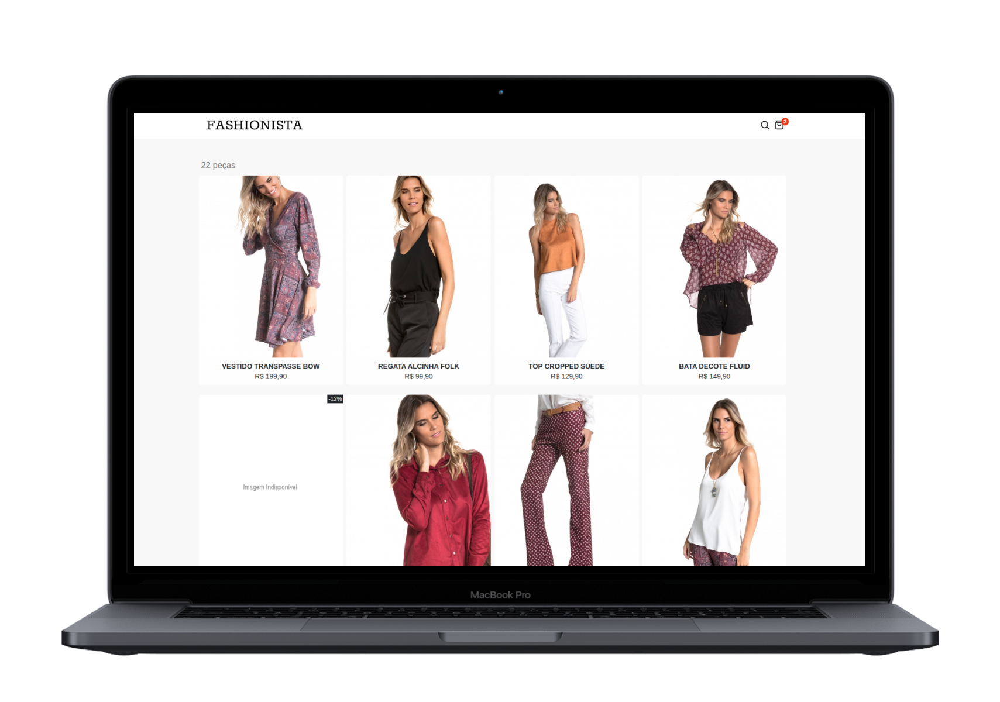
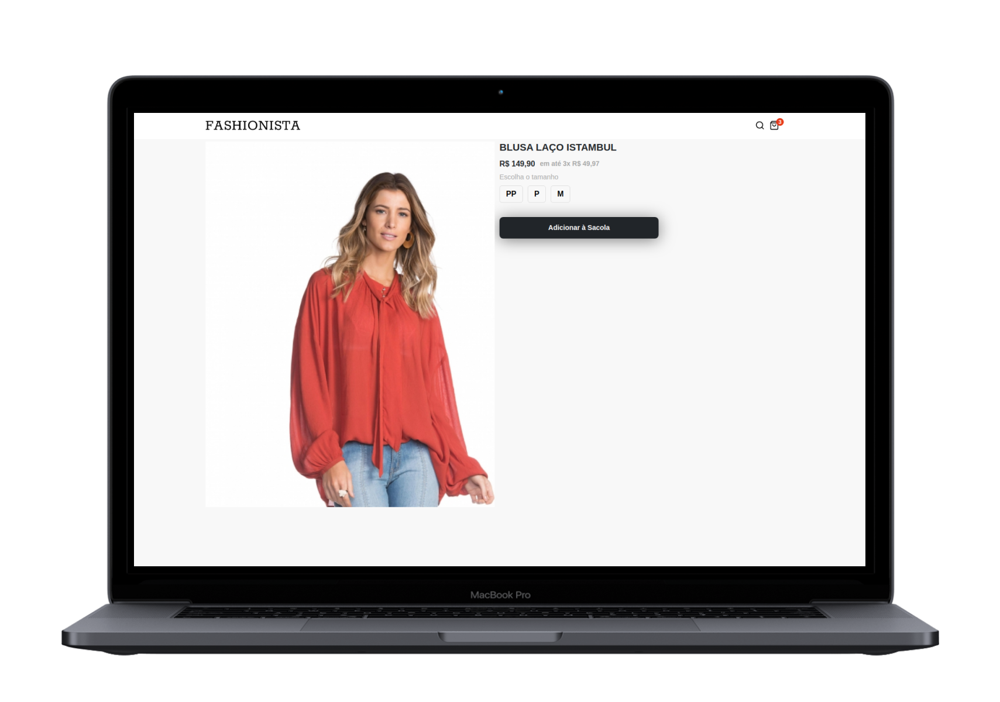
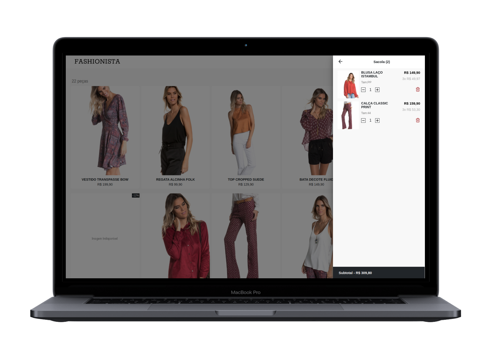
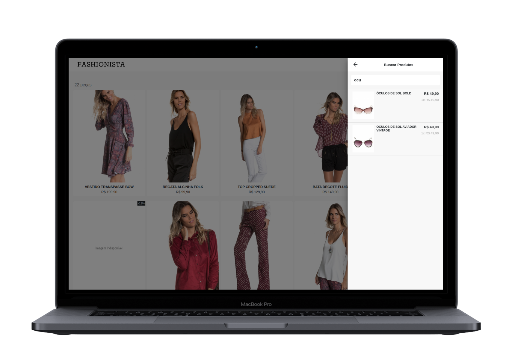

<h1  align="center">

</h1>

 

<h4  align="center">
	💅 Fashionista 
</h4>

<a  href="#telescope-projeto">🔭 Projeto</a>&nbsp;&nbsp;&nbsp;|&nbsp;&nbsp;&nbsp
<a  href="#computer-tecnologias"> 💻 Tecnologias</a>&nbsp;&nbsp;&nbsp;|&nbsp;&nbsp;&nbsp;
<a  href="#-preview">💜 Preview</a>&nbsp;&nbsp;&nbsp;|&nbsp;&nbsp;&nbsp;
<a  href="#-getting-started">🤠 Getting Started </a>

 
 

## :telescope: Projeto

**Fashionista**  é a aplicação desenvolvida como projeto prático da aceleração de React realizada pela  [Codenation](https://www.codenation.dev/), consiste em um e-commerce de moda feminina com objetivo de garantir a melhor experiencia possível para os usuários interagirem com os produtos.
Para visualizar o projeto em funcionamento [clique aqui.](https://luuck4s-react-fashionista.netlify.app/)

## :computer: Tecnologias

- [React Js;](https://pt-br.reactjs.org/)

- [Redux;](https://redux.js.org/)

- [Styled-Components;](https://styled-components.com/)

- [Axios.](https://github.com/axios/axios)

## 💜 Preview

 

## 🤠 Getting Started

Você precisa clonar o repositório e pode fazer isso digitando em seu terminal `$ git clone https://github.com/Luuck4s/Fashionista.git`.

Após clonar o repositório, execute  `$ yarn install`  ou  `$ npm install`.

Após as dependências serem instaladas, execute o comando  `$ yarn start`  ou  `$ npm run start`.

--- 

<h5 align="center"> 🚀 Fashionista   by Luuck4s 💜 </h5>

---